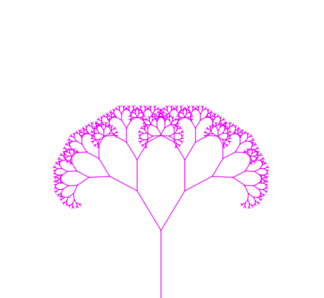

# Fractal-Trees
Generative fractal tree art created in JavaScript with p5.js. The fractal tree is set to animate automatically while rotating the angle, transitioning color, and changing the stroke weight. Press 'pause' to stop the animation.

[Link to Project](https://adi868.github.io/Fractal-Trees/)

